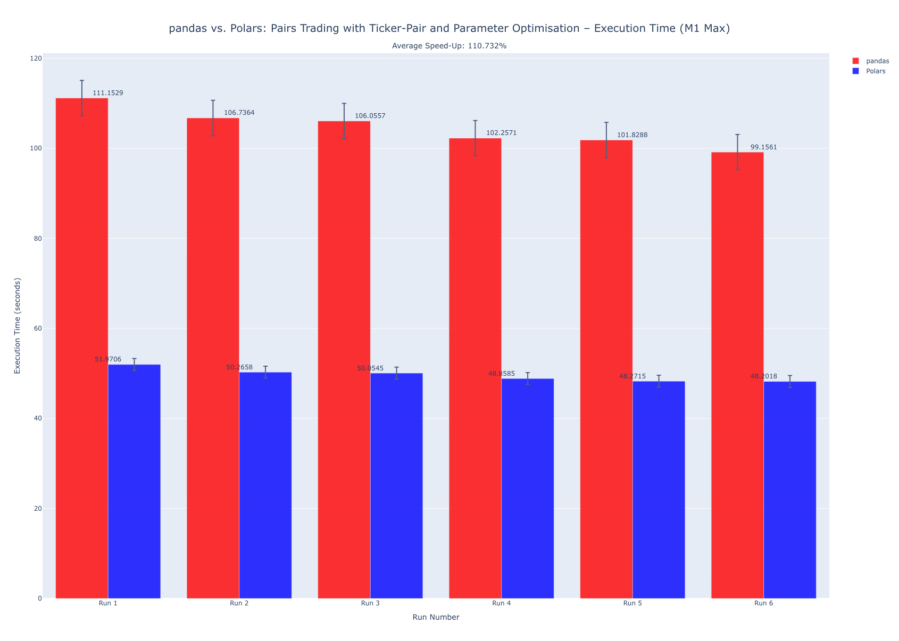
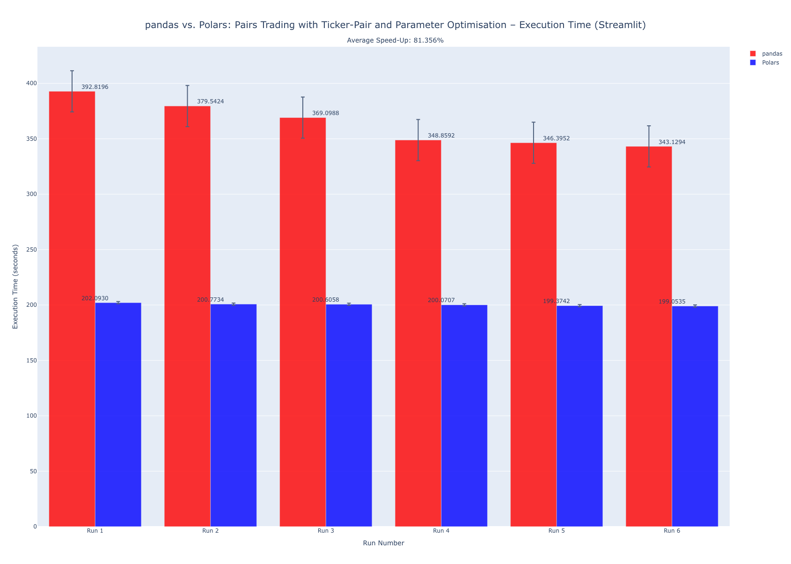

# Quant Trading Strategy Backtester

[](https://github.com/astral-sh/ruff)
[](https://github.com/IsaacCheng9/quant-trading-strategy-backtester/actions/workflows/test.yml)

A quantitative trading strategy backtester with an interactive dashboard.
Enables users to implement, test, and visualise trading strategies using
historical market data, featuring customisable parameters and key performance
metrics. Developed with Python.

_Try the deployed app
[here!](https://quant-trading-strategy-backtester.streamlit.app/)_

## Trading Strategies Supported

- Buy and Hold
- Mean Reversion
- Moving Average Crossover
- Pairs Trading

## Performance Benchmark of pandas vs. Polars Implementation

I originally implemented the backtester and optimiser using
[pandas](https://pandas.pydata.org/), but I wanted to explore the performance
benefits of using [Polars](https://pola.rs/).

After refactoring the code to use Polars, I manually benchmarked the two
implementations on my local machine (Apple M1 Max with 10 CPU cores and 32 GPU
cores, 32 GB unified memory) and on the deployed Streamlit instance. Each run
was a backtest from 2020/01/01 to 2023/12/31 for the pairs trading strategy,
with ticker-pair optimisation and parameter optimisation enabled.

**Polars had an average speed-up of over 110%\* compared to pandas on my local**
**machine, and over 80% on the Streamlit instance.**





The full benchmark results can be found in the CSV files in the
[resources folder](./resources).

## Usage

### Installing Dependencies

Run the following command from the [project root](./) directory:

```bash
poetry install
```

### Running the Application Locally

Run the following command from the [project root](./) directory:

```bash
poe app
```

Alternatively, run it directly with Poetry (skipping the Poe alias):

```bash
poetry run streamlit run src/quant_trading_strategy_backtester/app.py
```
