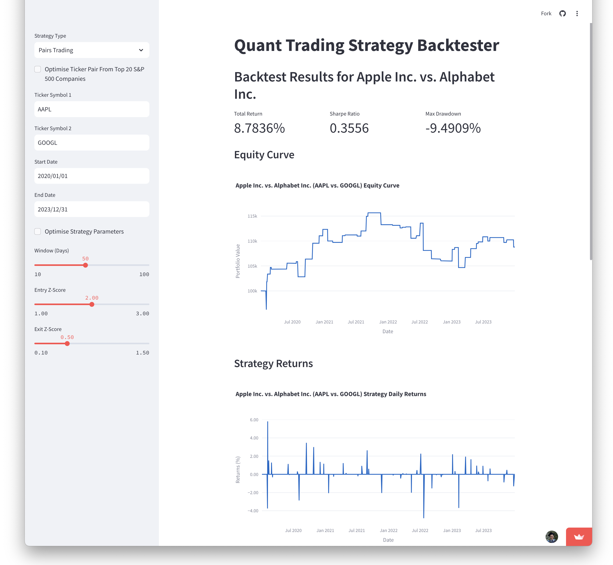
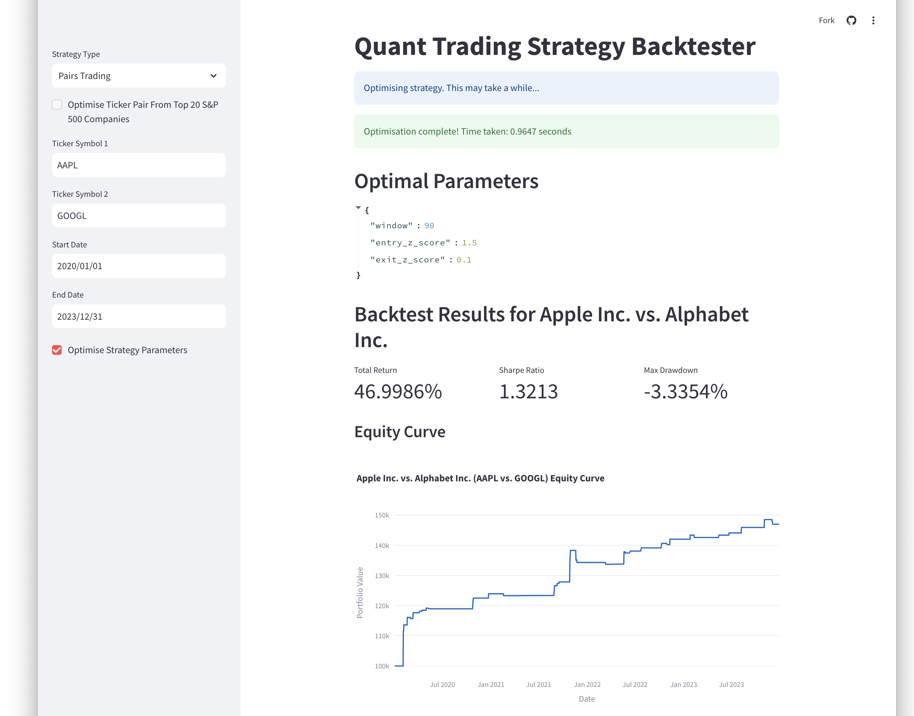
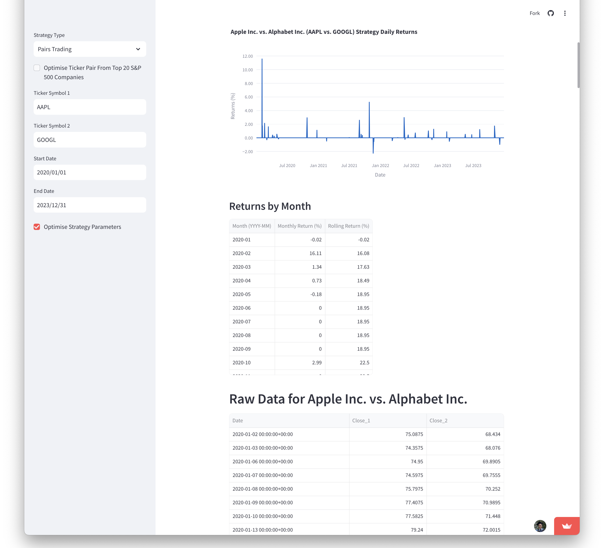

# Quant Trading Strategy Backtester

[](https://github.com/astral-sh/ruff)
[](https://github.com/IsaacCheng9/quant-trading-strategy-backtester/actions/workflows/test.yml)

A quantitative trading strategy backtester with an interactive dashboard.
Enables users to implement, test, and visualise trading strategies using
historical market data, featuring customisable parameters and key performance
metrics. Developed with Python.

_Try the deployed app
[here!](https://quant-trading-strategy-backtester.streamlit.app/)_

## Screenshots

<!-- markdownlint-disable-next-line MD033 -->
<details>
<!-- markdownlint-disable-next-line MD033 -->
<summary>Pairs Trading without Optimisation</summary>



</details>

<!-- markdownlint-disable-next-line MD033 -->
<details>
<!-- markdownlint-disable-next-line MD033 -->
<summary>Pairs Trading with Strategy Parameter Optimisation</summary>





</details>

## Trading Strategies Supported

- Buy and Hold
- Mean Reversion
- Moving Average Crossover
- Pairs Trading

## Key Features

- Interactive web-based dashboard using Streamlit
- Efficient data processing using Polars for improved performance
- Support for multiple trading strategies with customisable parameters
- Real-time data fetching from Yahoo Finance
- Automatic optimisation of strategy parameters and stock selection from S&P 500
- Visualisation of equity curves and strategy returns
- Performance metrics including Total Return, Sharpe Ratio, and Max Drawdown
- Monthly performance table with rolling returns

## Performance Benchmark of pandas vs. Polars Implementation

I originally implemented the backtester and optimiser using
[pandas](https://pandas.pydata.org/), but I wanted to explore the performance
benefits of using [Polars](https://pola.rs/).

After refactoring the code to use Polars, I manually benchmarked the two
implementations on my local machine (Apple M1 Max with 10 CPU cores and 32 GPU
cores, 32 GB unified memory) and on the deployed Streamlit instance. Each run
was a backtest from 2020/01/01 to 2023/12/31 for the pairs trading strategy,
with ticker-pair optimisation amongst the top 20 S&P 500 stocks and parameter
optimisation enabled.

**Polars was faster by 2.1x on average compared to pandas on my local**
**machine, and faster by 1.8x on average on the Streamlit instance.**


The full benchmark results can be found in the CSV files in the
[resources folder](./resources).

## Usage

### Installing Dependencies

Run the following command from the [project root](./) directory:

```bash
uv sync --all-extras --dev
```

### Running the Application Locally

Run the following command from the [project root](./) directory:

```bash
poe app
```

Alternatively, run it directly with uv (skipping the Poe alias):

```bash
uv run streamlit run src/quant_trading_strategy_backtester/app.py
```
